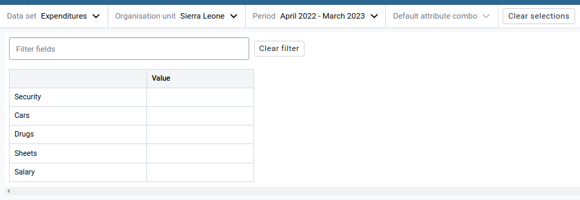
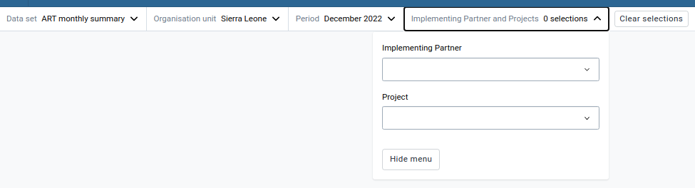
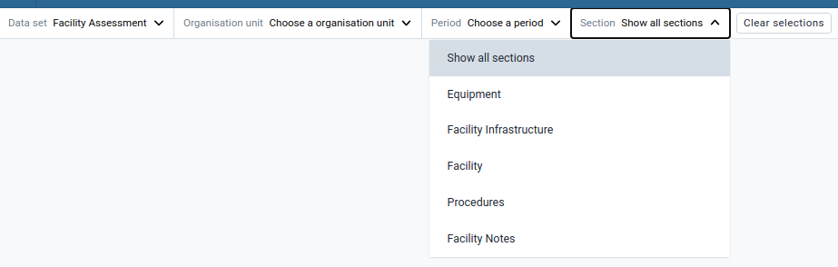
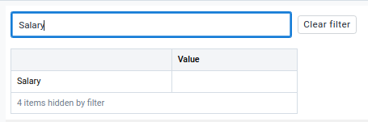
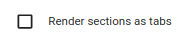
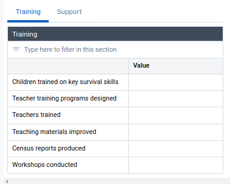
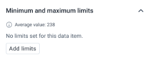
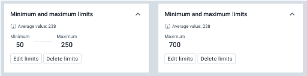
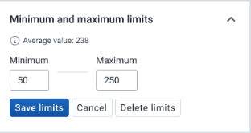

# Data Entry

The Data Entry app is where you manually enter aggregated data in DHIS2. You
register data for an organisation unit, a period, and a set of data elements
(data set) at a time. A data set often corresponds to a paper-based data
collection tool. You configure the data sets in the Maintenance app.

**Note:**

If a data set has both a section form and a custom form, the system displays
the custom form during data entry. Users who enter data can't select which form
they want to use. In web-based data entry the order of display preference is:

1. Custom form (if it exists)
1. Section form (if it exists)
1. Default form

<!-- @TODO: We don't support mobile browser currently, is this something we
need to support for feature parity? -->
Mobile devices do not support custom forms. In mobile-based data entry the
order of display preference is:

1. Section form (if it exists)
1. Default form

## Selecting a form

In order to select a form, the following three values are mandatory:

1. Data set
1. Period
1. Organisation unit

A data set, that has not been linked with an explicitly set attribute option
combination, will be linked to the "default" category which has only one
option: "Default option", therefore the user does not have to select any
category option.

### Data-set-dependent, required, categories

Depending on the data set, another selector item will be displayed, which will
render a set of required category inputs once opened.

### Section filter

When a data set is not connected to a custom form and is not a tabbed form, the
displayed section can be filtered by selecting a specific section in the
"Section" selection item.

## Editing forms in an auto-generated form

When successfully selecting a form and the selected data set is not connected
to a custom form, the app will render an auto-generated form, based on the data
set (and the category options - if applicable).

### Keyboard controls

The Data Entry app supports a limited amount of keyboard controls for easier
handling of the form:

| Description | Keyboard command | Exception |
|-|-|-|
| Go to the next input field | `Enter` or `Tab` | `Enter` has to be implemented in custom forms; `Tab` is the default browser behavior; should work in custom forms as well |
| Go to the previous input field | `Shift + Tab` | Default browser behavior; should work in custom forms as well |
| Open the details section of a data value | `Shift + Enter` |

### Filtering fields

The app renders an input field above the forms which can be used to search for
particular input fields (except custom forms):

### Tabbed forms

Data sets have an option to be rendered as tabs (see Maintenance app
documentation).

When the option is set, the form will be rendered in tabs
instead of in sections displayed underneath each other:

### Viewing the data value details

There are several ways to access the details of a data value:

- By doubling click on the input field
- By pressing Shift + Enter when focussing on an input field
- By clicking on the "View details" control in the bottom bar

Data details are information and actions about a specific data item in a data
set. The data details are split into the following units:

* Basic information
* Comment.
* Customisable value limits.
* Historical values reference.
* Audit log.

The individual units are collapsed by default, only the first one with the
basic information will be expanded initially.

Units can be expanded/collapsed by clicking on the header (which is the title
and the chevron icon).

#### Viewing the basic information of a data value

The first unit in the data value details contains the following values:

* name
* code
* ID
* last updated date
* follow-up state

##### Marking data values for follow-up

This unit contains a button which can be used to mark a data value for
follow-up or unmark it if it has been marked in the past.

#### Editing the comment of a data value

The second unit contains the comment. By default the comment can't be edited.

There is a button which can be used to change the comment into an input
field with the current comment as initial value.

The changes made can be saved by clicking on the "Save comment" button.
Alternatively the cancel button can be clicked, which will discard the changes
and revert to the comment before making any changes.

#### Adding/Editing the minimum and maximum range of a data value

In order to edit these values, the data value details section for the
respective data value has to be opened first. Then open the "Min- and max
range" section in the details section.

If the data value does not have any values attached, a button will be displayed
that will cause two input fields to show up:

If the data value does have some values attached already, these values will be
rendered. In order to edit the values, the "Edit limits" button has to be
pressed, which will cause the inputs to show up as well:

When adding or editing the limits, the updated values can either be saved by
clicking on the "Save limits" button or discarded by clicking on the "Cancel"
button:

Limits can be deleted by clicking on the "Delete limits button" both in normal
and in edit mode:

#### Viewing historical values in a chart

## Editing forms in a custom form

## Data values

### Marking data values for follow-up

### Add/Edit min- and max-range of the value

## Offline support

### Editing approved forms

## Related resources

