# Data Entry app

## About the Data Entry app { #aggregate_data_entry_app.about }

The Data Entry app is used to enter aggregate data in DHIS2. Aggregate data is collected at a group level and does not belong to any one individual. To enter individual-level data, see the [Capture app](#capture_app).

#### Version 2.41.3 and earlier

The app was titled **Data Entry (Beta)**. The beta label was removed in DHIS2 2.42, and in patch releases from 2.40.8 and from 2.41.4. The app is now called **Data Entry**. See the overview page for details of the name history.

## What makes a data entry form? { #aggregate_data_entry_app.what_makes_a_form }

You fill in each data entry form for a specific context. The context bar at the top of the app lets you choose:

- **Data set**: the collection of data elements that represent the data you want to collect.
- **Organisation unit**: where the data is registered, such as a clinic, hospital, or classroom.
- **Period**: the time the data is from.

After you select a data set, an organisation unit, and a period, the context bar can show additional selections, depending on how the data set is set up:

- **Section**: appears only if the data set uses a section form. Use it to show one section at a time, or select **All sections** to show the whole form.
- **Attribute option combination selectors**: appear only if the data set has attribute option combinations assigned. You see one selector for each category, such as a funding agency or implementing partner, and you must choose an option in each before you can enter data.

## Get to know the app { #aggregate_data_entry_app.get_to_know }

The Data Entry app is made up of the following sections:

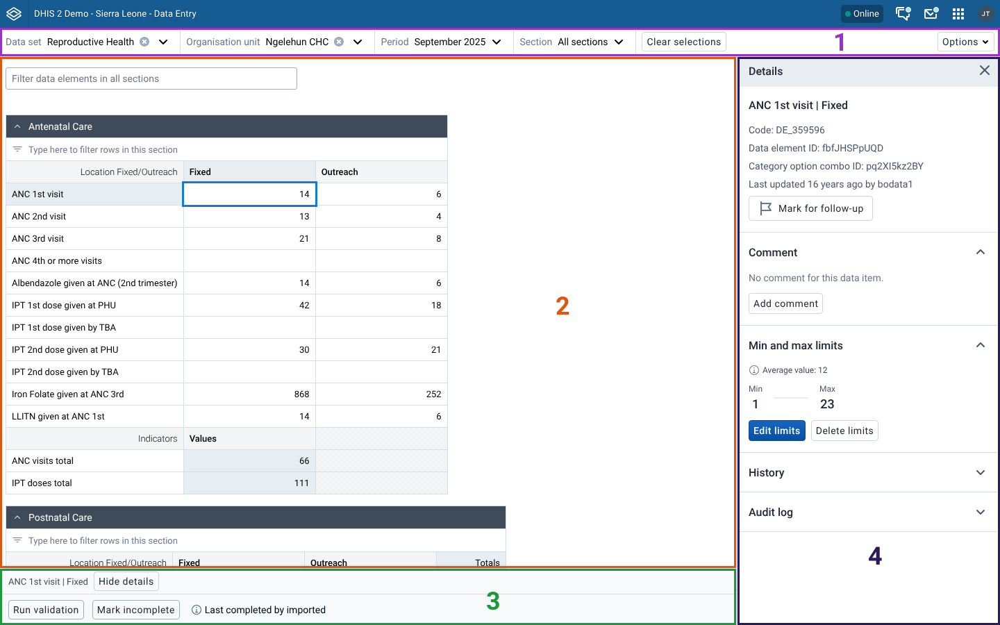

1. **Top bar**: Use the top bar to choose the options that open a data entry form. You can use the top bar at any time to change or reset your choices.
2. **Data workspace**: Use the data workspace to work with a data entry form.
3. **Bottom bar**: The bottom bar offers actions and more information about the form that you are working on.
4. **Details sidebar**: Use the details sidebar to see more information about data values and to see validation results. You can open and close the details sidebar as you work. It is closed by default.

## Working with a data entry form { #aggregate_data_entry_app.working_with_a_form }

### Opening a form { #aggregate_data_entry_app.opening_a_form }

To start data entry, open a form. Use the top bar to choose the form that you want to open:

1. Choose a data set from the first control in the top bar. The dropdown menu shows the data sets that you have access to. The data set determines what other choices are available, so choose a data set first.
2. Choose an organisation unit from the second control in the top bar. You can search for an organisation unit or browse the tree hierarchy.
3. Choose a period from the third control in the top bar. The dropdown menu shows the periods set up for the chosen data set. To choose a different year, click the left or right arrow button.
4. Make additional selections, if applicable. If additional selections are available, the app shows them as the last controls in the top bar. Additional selections depend on the data set, organisation unit, and period that you chose, so they do not appear until you make those first three choices. If there are no additional selections, the app shows no extra controls.

After you make the selections in the top bar, the data entry form opens in the data workspace. If there is a problem opening a form, the data workspace shows an error that explains the problem.

#### Searching for a data set { #aggregate_data_entry_app.searching_data_sets }

If you have access to more than one data set, a search field opens at the top of the data set menu. Type part of a data set name to filter the list. The search is not case-sensitive and matches any part of the name. The following screenshot shows the list after you type "hiv":

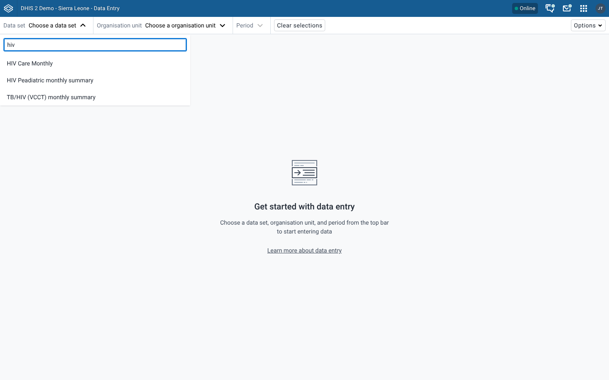

Choose a data set from the filtered list to continue.

##### Data Entry app version 101.0 and earlier

The search field is available in Data Entry app version 101.1.0 and later. To update the app, use the **App Management** app.

<!-- VERIFY IN APP: test a manual update of the Data Entry app to 101.1.0 or later on a 2.39 to 2.41 instance, and confirm where the app version is shown. -->

### Entering data { #aggregate_data_entry_app.entering_data }

After you open a form, you can enter data into the form cells. The active cell, which is the cell that you are entering data into, is always highlighted with a blue border. To work quickly, move around with your keyboard:

- To move to the next cell, press ++tab++, ++arrow-down++ or ++enter++.
- To go back to the previous cell, press ++shift+tab++ or ++arrow-up++.
- To show details, press ++ctrl+enter++ or ++cmd+enter++.

The **Shortcuts** section of the help sidebar shows these shortcuts. To open it, select **Options** > **Help**. 

#### Cell status { #aggregate_data_entry_app.cell_status }
Cells look different depending on their status:

| Cell    | Status                                                                                                                                           |
| ------- | ------------------------------------------------------------------------------------------------------------------------------------------------ |
| 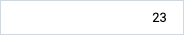  | Shows a value that is already saved, or an empty cell. |
| 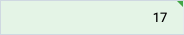   | The cell value is saved on the server. |
| 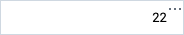 | The cell value is saved locally. It is syncing, or waiting to sync, to the server. |
| 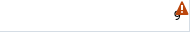 | The app could not save the value to the server, so the value is not saved. Hover over the cell to see the error message from the server. |
| 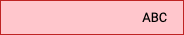     | There is a problem with the cell value. Click or hover over the cell to learn more about the problem. The app does not save these invalid values to the server or locally. |
| 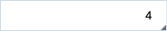 | The value has a comment. |
| 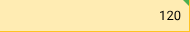 | The value is saved, but it is outside the minimum and maximum limits for this data element. Hover over the cell to see the limits. |
| 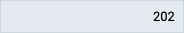  | The cell is locked and you cannot edit the value. |
| 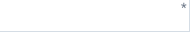 | The cell is a compulsory field. The asterisk is replaced by the synced marker once the app saves a value. If the data set requires compulsory fields, you must fill in all of them before you can complete the form. |

The **Cell reference** section of the help sidebar shows these statuses. To open it, select **Options** > **Help**. The statuses for failed sync, warning, and compulsory field are in the help sidebar from Data Entry app version 101.0.5.

### Filtering a form { #aggregate_data_entry_app.filtering }
Use a filter to find a certain cell in a form. You can filter the whole form, filter single sections, or both. Search for the name of a data element and rows where the name does not match are hidden.

#### Filtering the whole form { #aggregate_data_entry_app.filtering_whole_form }

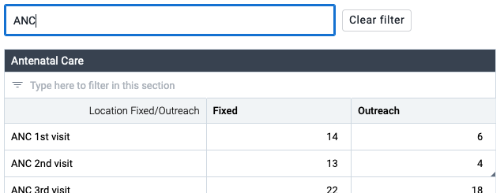{ width=60% }

To filter the whole data entry form, enter a value in the input at the top of the form.

#### Filtering a section { #aggregate_data_entry_app.filtering_section }

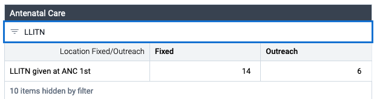{ width=60% }

For section forms, you can also filter inside a single section. Enter a value in the input at the top of a section.

### Validation { #aggregate_data_entry_app.validation }
When you are done entering data, you can run validation on the data values. Validation checks the values against rules set up in your DHIS2 instance.

To run validation, click **Run validation** in the bottom bar.

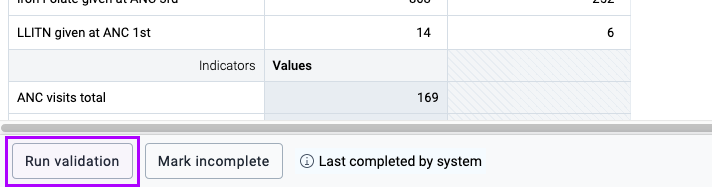{ width=60% }

The validation sidebar shows the validation results, grouped into high, medium, and low priority results. After you fix validation issues, click **Run validation again** to recheck the data values.

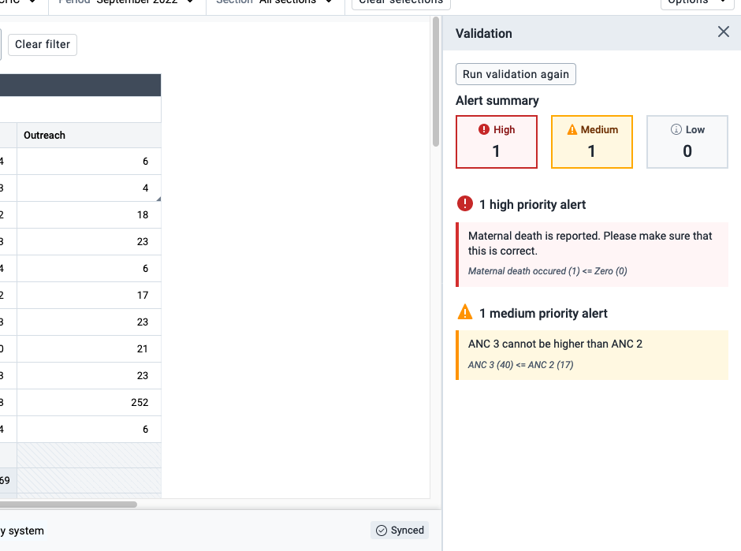

### Completing a form { #aggregate_data_entry_app.completing }

After you enter data and run validation, the last step is to complete the form. Completing a form means that you entered all the intended data and left empty cells empty on purpose. To mark a form as complete, click **Mark complete** in the bottom bar.

Clicking **Mark complete** also runs validation. If the data set has **Completing requires passing validation** or **Completing requires compulsory fields to have a value** turned on, the app blocks completion until the form meets that requirement.

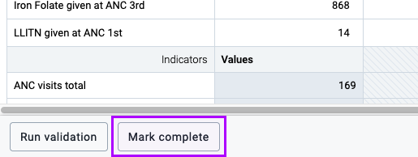{ width=60% }

If a form is complete but should not be, click **Mark incomplete** in the bottom bar to mark it as incomplete.

### Information in the bottom bar { #aggregate_data_entry_app.bottom_bar }

Besides **Run validation** and **Mark complete** or **Mark incomplete**, the bottom bar shows information about the form.

#### Who completed the form { #aggregate_data_entry_app.completed_by }

After a form is completed, the bottom bar shows **Last completed by** and the name of the user who completed it. After a form is marked incomplete, it shows **Last incompleted by** and the user name instead.

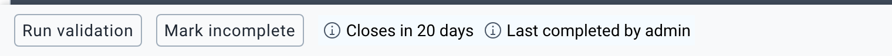{ width=60% }

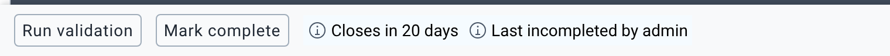{ width=60% }

#### When data entry closes { #aggregate_data_entry_app.closes }

If a time limit applies to the form, the bottom bar shows **Closes** and the time left, for example **Closes in 3 days**. Hover over the text to see the exact date and time. The time uses the time zone of the DHIS2 server, which can differ from the time zone of your computer.

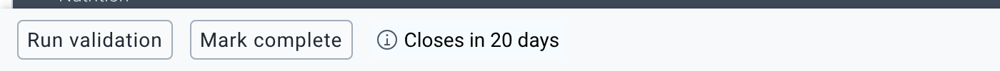{ width=60% }

The app uses the sooner of two dates: the closing date of the data input period, or the end of the expiry days of the data set. The expiry days count only if you do not have the authority to edit expired data. After the time passes, the form is locked and the text is no longer shown. See [Locked forms](#aggregate_data_entry_app.locked_forms).

#### Values that were not saved { #aggregate_data_entry_app.unsaved_values }

When values are not saved, a button appears in the bottom bar. Click the button to open a list of the affected values.

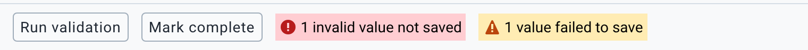{ width=60% }

- **1 invalid value not saved** (or **2 invalid values not saved**, and so on): the value does not match the data type of the data element. For example, you entered text in a number field. The cell shows the invalid status. Correct the value to save it.
- **1 value failed to save** (or **2 values failed to save**, and so on): the server did not accept the value. The cell shows the failed-sync icon. See the cell status table in [Entering data](#aggregate_data_entry_app.cell_status). To try again, click in the cell and then click outside it.

The header of the app shows **Online** or **Offline** to show the connection status. See [Working offline](#aggregate_data_entry_app.working_offline).

### Locked forms { #aggregate_data_entry_app.locked_forms }

A form can be locked, so you cannot add or change data. When this happens, a **Data set locked** notice appears above the form and gives the reason. You cannot edit the cells, and **Mark complete** is disabled. The reasons are:

| Message | Reason |
|---|---|
| Data cannot be added or changed because organisation unit is closed for the selected period. | The organisation unit has an opening date after the period or a closing date before the period. |
| Data cannot be added or changed outside of the data input period. | The data set has data input periods, and the selected period is not one of them, or today is outside the open and close dates. |
| Data cannot be added or changed because data entry has concluded. | The server locked the form. This happens when the expiry days of the data set have passed, or when the period is outside the data input periods of the data set. |
| Data cannot be added or changed because data has been approved. | The data was approved in data approval. |
| You do not have the authority to edit entry forms | Your user role does not include the authority to add data values. |

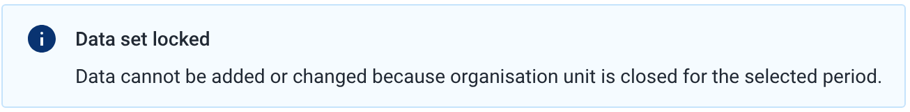

> **Note**
>
> If you have the authority to edit expired data, you can still enter data after the expiry days have passed.

To enter data in a locked form, ask your administrator to change the dates, or to unapprove the data.

### Indicators in a form { #aggregate_data_entry_app.indicators }

If the data set has indicators, they appear in a table with the heading **Indicators**, below the data elements of a section or at the bottom of the form. Indicator cells are read-only and show the value calculated from the data in the form. The value updates when you change data values.

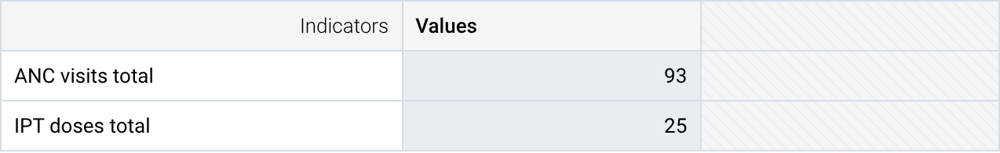{ width=60% }

The app calculates an indicator from the data in the form. It can calculate only expressions that use data element values (`#{dataElement}` or `#{dataElement.categoryOptionCombo}`), numbers, and arithmetic. For an expression that uses anything else, such as a constant, another indicator, or an organisation unit group count, the cell shows an information icon. Hover over the icon to see **This value cannot be calculated in this app**. The form never shows these indicators, even after analytics tables are generated. To see them, use the Data Visualizer app or another analytics app.

If the denominator is zero, the cell shows a warning icon. The hover text explains that the expression is not mathematically calculable.

### Doing more with data values { #aggregate_data_entry_app.doing_more_with_data_values }

The previous sections cover the basic data entry functionality. The Data Entry app also offers more actions and information. You find them in the data details sidebar, which is on the right of the data workspace.

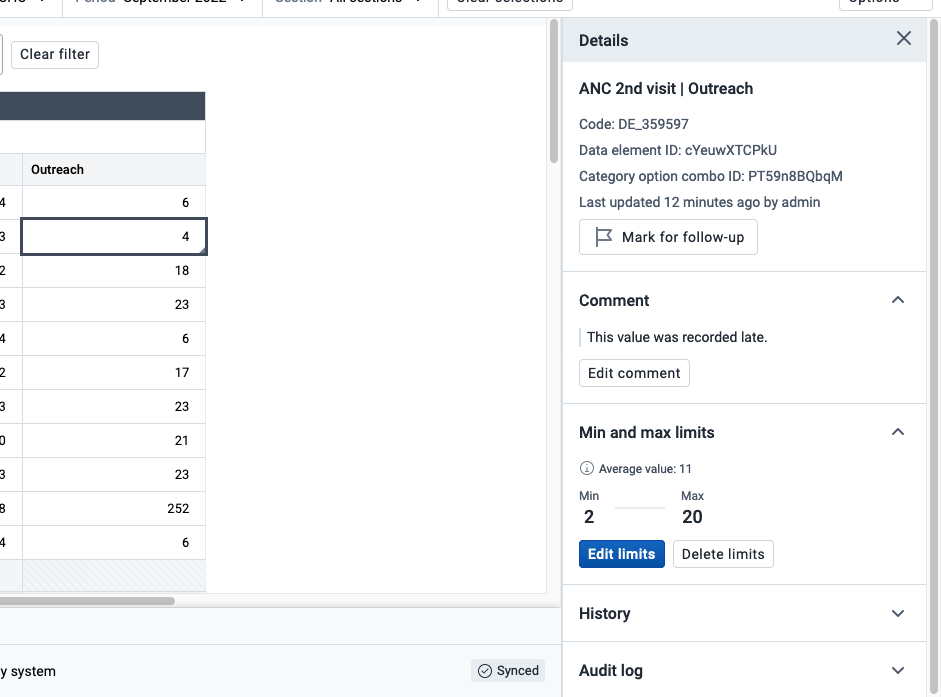

#### Opening the data details sidebar { #aggregate_data_entry_app.opening_data_details_sidebar }

You can open the data details sidebar in two ways:

- With a data entry cell selected, click **View details** in the bottom bar.
- With a data entry cell selected, press ++ctrl+enter++ or ++cmd+enter++.

The data details sidebar stays open until you close it, or until you change the data set, organisation unit, period, or attribute option combination. You can keep it open for reference as you work through a data entry form.

#### Mark data values for follow-up { #aggregate_data_entry_app.mark_followup }

Marking data values for follow-up can help you highlight suspicious or odd values that need investigation. DHIS2 still saves data values that you mark for follow-up, and the **Data Quality** app highlights them for further investigation or analysis.

To mark a data value for follow-up, open the data details sidebar, then click **Mark for follow-up** in the top section. You cannot mark empty values for follow-up.

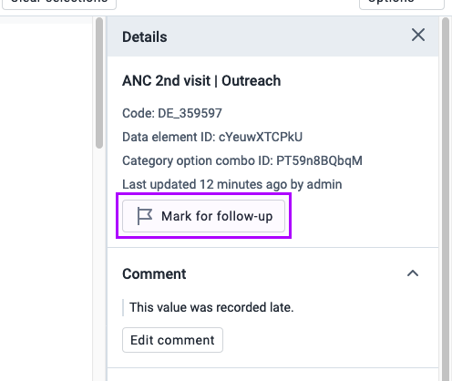{ width=60% }

To unmark a data value, click **Unmark for follow-up**.

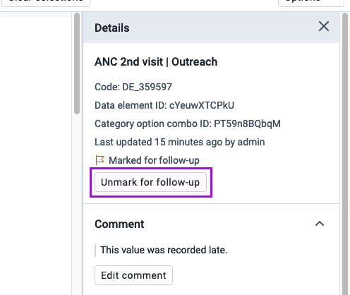{ width=60% }

#### Comment on a data value { #aggregate_data_entry_app.comments }

You can add a comment to any data value. Comments can add information about a value, such as the reason that a value is unusually high or outside the normal range.

To add a comment to a data value, open the data details sidebar, then click **Add comment** in the **Comment** section.

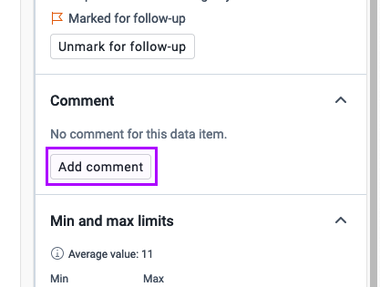{ width=50% }

After you write the comment, click **Save comment**.

If a data value already has a comment, click **Edit comment** below the comment to edit it.

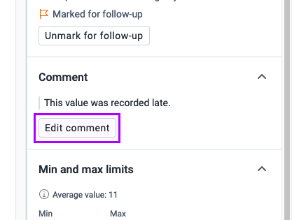{ width=50% }

#### Minimum and maximum limits { #aggregate_data_entry_app.limits}

A data value can have a minimum and maximum limit. A value outside the limits is still saved, but the cell shows a warning.

To add limits to a data value, open the data details sidebar, then click **Add limits** in the **Min and max limits** section. The average value of the limits, (Min+Max)/2, is shown to help. 
**Add limits** is disabled when offline.

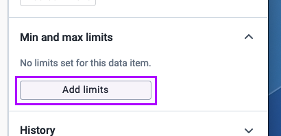{ width=50% }

After you add a minimum and maximum limit, click **Save limits**.

If a data value already has limits, you can change or remove them. To change the limits, click **Edit limits**. To remove the limits, click **Delete limits**.

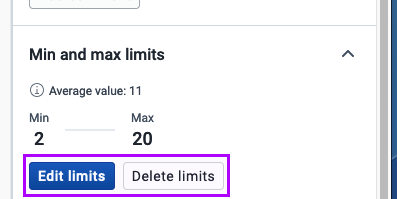{ width=50% }

#### Rules for limits { #aggregate_data_entry_app.limits_rules }

- Both **Min** and **Max** are required. You cannot save only one of them.
- **Min** must be lower than **Max**.
- Both values must be whole numbers that are valid for the value type of the data element. For example, a positive integer data element needs positive limits.
- You can set limits only for data elements with a numeric value type.
- You need the authority to add limits, and a separate authority to delete them. If you do not have the authority, the button is disabled. Hover over the button to see the reason.

> **Note**
>
> Adding, changing, or removing limits requires the correct user privileges. When limits are applied to a data value, the same limits apply for everyone who enters that data element and category option combination for that organisation unit. 
> The limits are not tied to a data set. If another data set contains the same data element, the same limits apply there too.

#### Historical data { #aggregate_data_entry_app.history }

To learn more about a data value, you can see its value in the current period and in the 12 earlier periods. Open the data details sidebar, then open the **History** section.

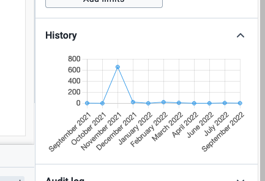{ width=60% }

When you work through a data entry form, the **History** section is closed by default, so the app does not send too much network data for every value.

#### Audit log { #aggregate_data_entry_app.audit_log}

Every data entry cell has an audit log that shows when values changed and who changed them. To see the audit log, open the data details sidebar, then open the **Audit log** section.

<!-- todo: add image when bug fixes merged -->

When you work through a data entry form, the **Audit log** section is closed by default, so the app does not send too much network data for every value.

### Printing { #aggregate_data_entry_app.printing }

To print a data entry form, click **Options** in the top bar. From the dropdown menu, choose to print the form with its data values, or to print an empty form.

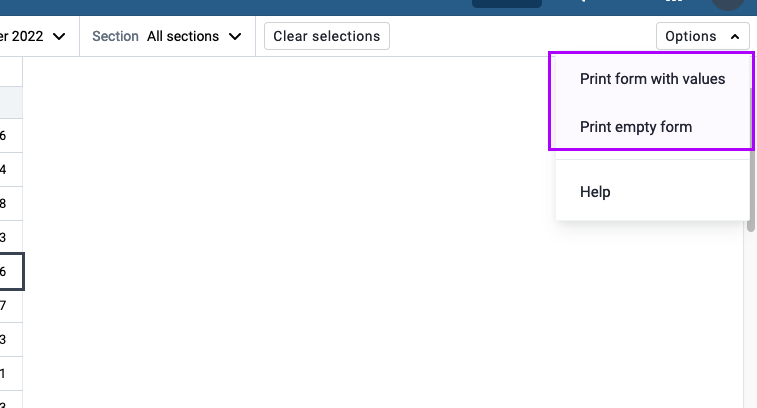{ width=80% }

## Working offline { #aggregate_data_entry_app.working_offline }

You do not need a connection to the internet or to the DHIS2 server to enter data. The app saves data that you enter in forms while you are offline on your local computer. When you reconnect to the internet or the server, your locally saved data syncs automatically with your DHIS2 server.

To work offline, open the Data Entry app while you are connected to the internet. The app then downloads the data entry forms and stores them on your local computer. Forms download automatically in the background.

The badge in the header bar at the top of the screen shows your connection status. If you are not connected to the internet or the DHIS2 server, the badge shows **Offline**. While you are offline, form cells that you enter data into also show the waiting to sync status.

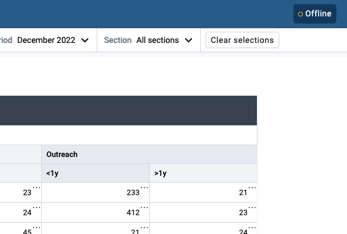{ width=60% }

> **Note**
>
> Some features are not available offline because they need contact with a DHIS2 server.
> Validation, data value history, and data value audit logs are not available offline.

## Features not supported { #aggregate_data_entry_app.unsupported_features }

- **Custom forms** that contain JavaScript work only in Data Entry app version 102.0.0 and later. To update the app, use the **App Management** app.

- **Multi-organisation unit entry** is not supported.

## Related information { #aggregate_data_entry_app.related_info }

- [Control data quality](#control_data_quality)
- [Manage data sets and data entry forms](#manage_data_set)
- [Using the Maintenance app](#maintenance_app)

